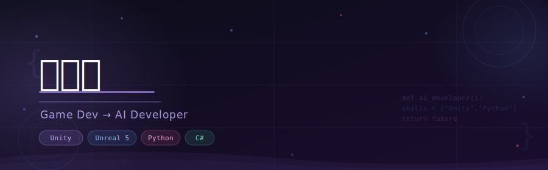

 

## 🙋‍♀️ About Me

> **게임 클라이언트 개발 · 3D 아트 3년 4개월 경력**을 바탕으로  
> 이제 **AI 개발자**로의 전환을 준비하고 있습니다.  
> 시각적 감각과 개발 역량을 결합해 더 넓은 가능성을 탐구 중입니다.

 

<table>
  <tr>
    <td>📍 위치</td>
    <td>대한민국</td>
    <td>💼 경력</td>
    <td>3년 4개월</td>
  </tr>
  <tr>
    <td>📧 이메일</td>
    <td><a href="mailto:nmnmxe@gmail.com">nmnmxe@gmail.com</a></td>
    <td>🎓 학력</td>
    <td>시각정보디자인 졸업</td>
  </tr>
</table>

 

---

## 🛠️ Tech Stack

### 🤖 AI / ML (학습 중)

### 🎮 Game Development

### 🎨 3D / Art

### ⚙️ Tools

 

---

## 📊 GitHub Stats

  

 

---

## 📫 Contact

 

